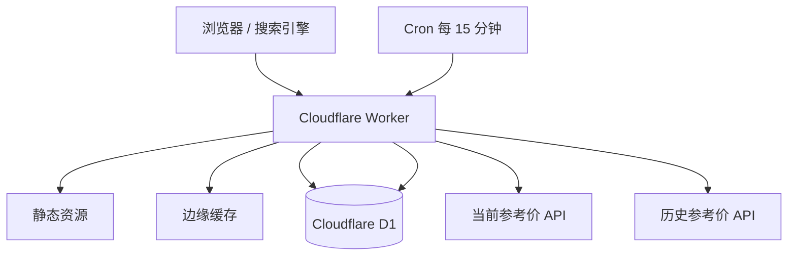

# FXPulse 技术架构

## 方案结论

MVP 采用 Cloudflare Workers 全栈方案：同一个 Worker 返回服务端 HTML、API 和静态资源，Cron Trigger 定时采集，D1 保存快照。开发和构建使用 Cloudflare 官方 Vite Plugin，让本地 Worker 在 workerd 中运行。Cloudflare 已支持 Workers 直接托管静态资源，并提供从 Pages 迁移至 Workers 的官方路径，因此无需再维护“Pages 前端 + 独立 API Worker”两套部署。



## 请求路径

| 路径 | 处理方式 | 缓存 |
|---|---|---|
| `/`、`/rates/*` | Worker 服务端生成语义化 HTML | HTML 5 分钟 |
| `/api/rates` | 当前价提供方，返回 11 币种子集 | 边缘 5 分钟 |
| `/api/history` | D1 快照优先，不足时 Frankfurter | 边缘 1 小时 |
| `/assets/*` | Workers Static Assets | 长缓存 + immutable |
| `/sitemap.xml` | Worker 动态生成所有币种对 | 24 小时 |
| `/llms.txt` | Worker 生成 AI 可读说明 | 24 小时 |

## 数据模型

D1 只存储每个币种相对 USD 的报价，避免重复保存 110 个交叉币种对。

```sql
rate_snapshots(
  quote TEXT,
  rate REAL,
  observed_at INTEGER,
  source_updated_at INTEGER,
  provider TEXT
)
```

查询任意币种对时，同一时间点按以下公式计算：

`rate(base, quote) = rate(USD, quote) / rate(USD, base)`

## 数据可信度

- 当前价和历史价来自不同类型的数据源，响应中必须返回 `provider` 与 `sourceUpdatedAt`。
- 当前开放价源不是银行逐笔实时行情，UI 统一称为“市场参考价”。
- Frankfurter 历史数据按日发布，用于冷启动和较长周期，不冒充盘中走势。
- Worker 不生成补点或随机数据；数据不可用时明确失败。

## 安全边界

- 仅接受固定 11 个 ISO 币种代码。
- 历史周期仅接受 7、15、30、90、365。
- 上游地址写死在 Worker，不提供 URL 代理能力。
- 所有页面设置 CSP、`X-Content-Type-Options`、`Referrer-Policy` 与 `Permissions-Policy`。
- 不处理账号、交易、Cookie 或个人数据。

## 部署步骤

1. 在 Cloudflare 创建 D1 数据库 `fxpulse-db`。
2. 将真实数据库 ID 写入 `wrangler.jsonc`。
3. 执行远端迁移。
4. 执行 `npm run deploy`。
5. 配置自定义域名并提交 sitemap。

生产部署属于外部变更，需在 Cloudflare 账户授权后执行。
