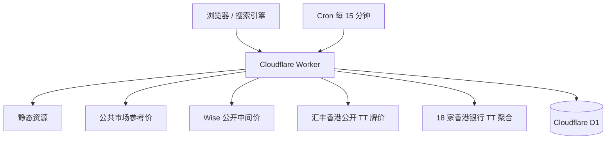

# FXPulse 技术架构

## 方案结论

FXPulse 使用 Cloudflare Workers 全栈方案：同一个 Worker 返回服务端 HTML、API 和静态资源，Cron Trigger 定时采集，D1 保存历史快照。页面访问时读取公共市场、Wise、汇丰香港官方 TT，以及 18 家香港零售银行公开 TT 牌价。



所有当前价都通过公开匿名接口或公开牌价页获取，不需要 Wise Token、银行账号、Cookie 或登录会话。汇丰行由官网匿名接口校准，其余银行明确标记为公开聚合数据。

## 请求路径

| 路径 | 处理方式 | 缓存 |
|---|---|---|
| `/`、`/rates/*` | Worker 服务端生成语义化 HTML | HTML 5 分钟 |
| `/api/rates` | 返回 11 币种公共市场参考价 | 边缘 5 分钟 |
| `/api/compare` | 公共市场、Wise、汇丰同方向比较 | 边缘 1 分钟 |
| `/api/overview` | 一个基准币种对应 10 个目标币种的三源批量报价 | 边缘 1 分钟 |
| `/api/banks` | 当前币种对的 18 家香港银行 TT 排行与缺失状态 | 边缘 5 分钟 |
| `/api/history` | 多来源 D1 历史；公共市场不足时回退 Frankfurter | 边缘 5 分钟 |
| `/sitemap.xml` | 动态生成全部 110 个有向币种对 | 24 小时 |
| `/llms.txt` | AI 可读的数据口径说明 | 24 小时 |

## 汇率方向模型

公共市场使用同一份 USD 锚定快照：

```text
market(base → quote) = USD→quote / USD→base
```

Wise 直接请求页面当前的 `source → target` 公开中间价。

香港银行公开牌价以 HKD 表示每单位外币的 TT Buy / TT Sell：

```text
客户卖出 BASE、买入 QUOTE

BASE = HKD：1 / QUOTE.TT_SELL
QUOTE = HKD：BASE.TT_BUY
其他交叉盘：BASE.TT_BUY / QUOTE.TT_SELL
```

因此公共市场正反方向严格互为倒数，Wise 因提供方显示精度可能有极小舍入差；银行 TT 正反方向不会互为倒数，因为两边分别包含 TT 买卖价差。这是正确的银行报价语义。`/api/banks` 按同样 1 单位基准币种可得目标币种数量由高到低排序，数值越高代表该方向的公开牌价越优。

## D1 数据模型

公共市场历史只保存相对 USD 的 11 个币种：

```sql
rate_snapshots(
  quote,
  rate,
  observed_at,
  source_updated_at,
  provider
)
```

Wise、汇丰与香港银行币种对保存有方向的来源报价：

```sql
provider_rate_snapshots(
  provider,
  base,
  quote,
  rate,
  rate_type,
  observed_at,
  source_updated_at,
  metadata_json
)
```

Wise 归档允许在缺少同方向数据时取倒数；汇丰和其他银行归档只读取完全匹配的方向，绝不把 TT 反向价简单倒数。历史接口通过 `sources=market,wise,hsbc_public,bank_boc...` 返回多个独立序列；只有公共市场允许 Frankfurter 冷启动，银行历史不足时返回明确不可用状态。

银行定时采集每小时只读取 10 个非 HKD 公开牌价页，然后在 Worker 内存中推导 18 家银行全部可用方向；D1 以每批最多 100 条写入，避免为 110 个币种方向重复请求上游。

## 数据可信度与降级

- 所有来源返回 `provider`、`sourceUpdatedAt`、`observedAt` 与 `rateType`。
- 汇丰卡片同时返回计算口径，例如 `USD TT Buy ÷ AUD TT Sell`。
- 当前实时请求失败时只使用该来源最近一次归档，并标记“归档”。
- 没有归档时显示“暂不可用”，不复制另一来源的数字。
- 汇丰公开牌价是官网指示性牌价，不是登录后优惠价或保证成交价。
- 银行聚合牌价保留来源链接、采集时间与缺失状态；聚合页与银行官网可能存在数分钟时间差。
- Worker 不生成补点、随机数据或拿另一来源曲线冒充银行历史。

## 安全边界

- 仅接受固定 11 个 ISO 币种代码和 7、15、30、90、365 天周期。
- 上游地址写死在 Worker，不提供任意 URL 代理能力。
- 不接收汇丰登录 Token、Cookie、账户号或个人资料。
- 不需要第三方 API Secret；D1 ID 是资源标识符，不是访问凭据。
- 页面设置 CSP、`X-Content-Type-Options`、`Referrer-Policy` 与 `Permissions-Policy`。

## 部署

1. 在 Cloudflare 创建并绑定 D1 数据库 `fxpulse-db`。
2. 执行 `npm run db:migrate:remote`。
3. 执行 `npm run check`。
4. 执行 `npm run deploy`，或由 GitHub 连接自动部署 `main`。
5. 验证 `/api/compare?base=USD&quote=AUD` 与反向币种对。
